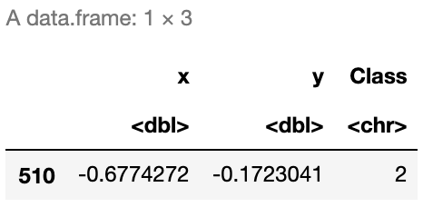

# Introduction
The idea of this notebook is to explore a step-by-step approach to create a <b>Linear Classifier with Softmax</b> without the help of any third party library. We will later compare its results with two other supervised learning algorithms such as Neural Networks and K-Nearest Neighbors in order to see if there's any difference in performance and accuracy.

In practice, these Algorithms should be useful enough for us to classify our data whenever we have already made clusters (in this case color) which will serve as a starting point to train our models.

## 1. Working Data

```R
# Load Data
SampleData <- read.csv("sample.csv")
SampleData$Class <- as.character(SampleData$Class)
```

```R
# Display all data
library(ggplot2)
colsdot <- c("1" = "blue", "2" = "darkred", "3" = "darkgreen")
ggplot() + 
  geom_point(data=SampleData,mapping=aes(x,y, colour=Class),size=3 ) +  
  scale_color_manual(values=colsdot) +
  xlab('X') + ylab('Y') + ggtitle('All Sample Data')
```


As we can observe, our data has 900 points distributed in the complex form of a spiral and it's classified in 3 clusters (Red, Green and Blue) en equal amounts (300 per class).

### 1.1 Train and test sample generation

We will create 2 different sample sets:
- <b>Training Set:</b> This will contain 75% of our working data, selected randomly. This set will be used to train our model.
- <b>Test Set:</b> Remaining 25% of our working data, which will be used to test the accuracy of our model. In other words, once our predictions of this 25% are made, will check the "<i>percentage of correct classifications</i>" by comparing predictions versus real values.

```R
# Training Dataset
smp_siz = floor(0.75*nrow(SampleData))
train_ind = sample(seq_len(nrow(SampleData)),size = smp_siz)
train =SampleData[train_ind,]

# Test Dataset
test=SampleData[-train_ind,]
OriginalTest <- test
```

### 1.2 Train Data

With this data we will generate train our models. This corresponds to 75% of our data.

```R
# Display data
library(ggplot2)
colsdot <- c("1" = "blue", "2" = "darkred", "3" = "darkgreen")
ggplot() + 
  geom_point(data=train,mapping=aes(x,y, colour=Class),size=3 ) +  
  scale_color_manual(values=colsdot) +
  xlab('X') + ylab('Y') + ggtitle('Train Data')
```


By comparing to the "all sample data" plot we can now observe much fewer points. These points will be used to train our algorithms into learning our training data classifications (RGB colors) as shown below.

### 1.3 Test Data

This corresponds to leftover (25%) data. Even though in this scenario we already know it's classification, we will simulate a more realistic case in which we don't, in order to "predict" it's colors.

```R
# Display data
library(ggplot2)
ggplot() + 
  geom_point(data=test,mapping=aes(x,y),size=3 ) +  
  scale_color_manual(values=colsdot) +
  xlab('X') + ylab('Y') + ggtitle('Test Data')
```


As seen in the plot above we now have many points missing since this only represents 25% of our training data. Additionally, our spiral is not very clear now and colors are completely gone. <b>We will try to predict these colors</b> by creating different algorithms which we will later compare in order to observe its accuracy.

## 2. Linear Classifier with Softmax

Below is a step-by-step example of a Linear Classifier with Softmax cost function.
What we want to achieve is for each selected gray point above (our test values), where we allegedly don't know it's true color, find the correct classification by finding the correct linear combination of characteristics in a very similar way on how we usually generate our lineal models.


Note that our Weight (W) and Bias (b) are both Vectors, which dimensions of 2x3 and 1x3 respectively.

<b>Aditionally, we need to define: </b>
- <b>Score Function: </b> Our linear classifier.
- <b>Cost Function: </b> In this case we will use Softmax since it provides an intuitive output in the form of a normalized class probability. We will use cross-entropy loss.
- <b>Optimization Method</b>: We will use gradient descent in order to minimize our cost function.

### 2.1 Features and Parameter Initialization

```R
# We define features
X <- data.frame(A=train$x,B=train$y)
y <- data.frame(y=train$Class)

# Variables: Number Classes, Dimensions and Scores per Class
K <- nrow(unique(y))
D <- ncol(X)
N <- nrow(X)/K

# One-hot encoding of Classes
Y <- matrix(0, nrow(y), K)
for (i in 1:(nrow(y))){
  Y[i, as.numeric(y[i,])] <- 1
}

# Initialize parameters
W <- 0.01 * matrix(rnorm(D*K), nrow = D)
b <- matrix(0, nrow = 1, ncol = K)
```

### 2.2 Parameter Calculation using Gradient Descent

<b>Original Parameters</b>

```R
cat("Weights (W)")
W
cat("Bias (b)")
b
```


<b>New (learned) Parameters:</b>

```R
# Gradient Descent
LearningRate <- 1
reg = 0.0001
for (i in 1:30000) {
  
  # We calculate Scores and Probs
  scores <- as.matrix(X) %*% W + matrix(rep(b,N*K), nrow = N*K, byrow = T)
  exp_scores <- exp(scores)
  probs <- exp_scores / rowSums(exp_scores)
  
  # compute the loss: sofmax and regularization
  corect_logprobs <- -log(probs)
  data_loss <- sum(corect_logprobs*Y)/nrow(X)
  reg_loss <- 0.5*reg*sum(W*W) 
  loss <- data_loss + reg_loss
  
  if(i %% 10000==0) {
    # Print on the screen some message
    cat(paste0("Iteration ", i,": ",loss,"\n"))
  }
  
  # Gradients
  dscores <- (probs-Y)/nrow(X)
  dW <- t(X)%*%dscores
  db <- colSums(dscores)
  
  dW = dW + reg*W # regularization gradient
  
  W <- W - dW*LearningRate
  b <- b - db*LearningRate
  
  
}
cat("\n\nNew Weights (W)")
W
cat("New Bias (b)")
b
```


### 2.3 Evaluation

<b>2.3.1 Real Classification Example</b>

Let's calculate the Class probability of a random number from the Dataset, such as the point number 356.

```R
SampleData[356,]
```



As observed, we already know the correct class is 2 (Red).

<b>2.3.2 Predicted Classification Example</b>

Lets see if our classifier works as expected. For this we need to remember the formula:


```R
sample_score <- c(SampleData[356,]$x,SampleData[356,]$y) %*% W + b
exponencial_score <- exp(sample_score)
probabilities <- exponencial_score / rowSums(exponencial_score)
probabilities
```


As seen above, we calculate a 96% chance of this data point being red, which is <b>correct</b>.

<b>2.3.3 Another Example</b>

Let's try with another random number, such as data point number 471

```R
sample_score <- c(SampleData[471,]$x,SampleData[471,]$y) %*% W + b
exponencial_score <- exp(sample_score)
probabilities <- exponencial_score / rowSums(exponencial_score)
probabilities
```


As observed our model predicts it to be Blue with 66% probability. But as seen below, it's true color is green (Class 3) which the model assigned only 23% chance.

```R
SampleData[471,]
```


### 2.4 Accuracy

First, we need to generate our classification function.
This will allow us to evaluate every single data point within our training data set.

```R
# Classification
Color <- function(X,W,b,K) {
  N <- nrow(X)
  scores <- as.matrix(X) %*% W + matrix(rep(b,N), nrow = N, byrow = T)
  exp_scores <- exp(scores)
  probs <- exp_scores / rowSums(exp_scores)
  Class <- apply(probs, 1, which.max)
  Class <- data.frame(prob=Class)
  return(Class$prob)
}
```

```R
# Predict Train Data
Real <- data.frame(Real=y$y)
Real$Prediction <- Color(X,W,b,K)
Real$Match <- ifelse(Real$Real == Real$Prediction, 1, 0)
Accuracy <- round(sum(Real$Match)/nrow(Real),4)
print(paste("Accuracy of ",Accuracy*100,"%",sep=""))
```


Even though our data point Nº356 was correctly classified, it seems that this model performs correctly only <b>56% of the times</b> on our train sample. Note that even though this might seem low, in fact, is a significal increase from random chance where we would expect only <b>33% accuracy</b>.

### 2.5 Predicting our Test Sample

```R
# Predict Test Data
Real <- data.frame(Real=test$Class)
Real$Prediction <- Color(test[,1:2],W,b,K)
Real$Match <- ifelse(Real$Real == Real$Prediction, 1, 0)
Accuracy <- round(sum(Real$Match)/nrow(Real),4)
print(paste("Accuracy of ",Accuracy*100,"%",sep=""))

# Display data
colsdot <- c("1" = "blue", "2" = "darkred", "3" = "darkgreen")
PClass <- as.character(Real$Prediction)
ggplot() + 
  geom_point(data=test,mapping=aes(x,y, colour=PClass),size=3 ) +  
  scale_color_manual(values=colsdot) +
  xlab('X') + ylab('Y') + ggtitle('Train Data')
```


